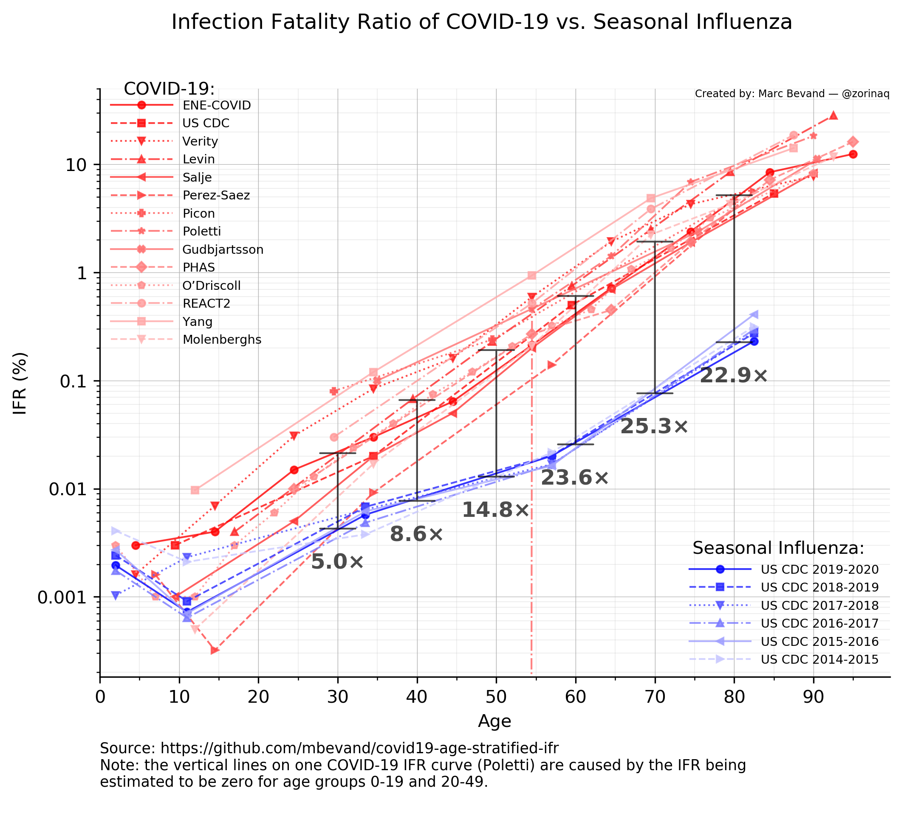

*Updated: 20 Jun 2021*

Author: Marc Bevand

This project studies the age-stratified infection fatality ratio (IFR) of COVID-19:
* compare COVID-19 to seasonal influenza (flu)
* calculate the expected overall IFR based on countries' population pyramids
* calculate the age-stratified IFR of COVID-19 from the Spanish ENE-COVID serosurvey

# Comparing COVID-19 to seasonal influenza



The above chart compares the IFR of COVID-19 to the IFR of seasonal influenza. We
find that COVID-19 is definitely significantly more fatal than influenza at all
ages above 30 years. The source code producing this chart is
[covid_vs_flu.py](covid_vs_flu.py).

The vertical indicators represent the difference in fatality between COVID-19
and influenza at various ages, from 30 to 80 years at 10-year intervals. The
top/bottom of the indicators are anchored at the geometric means of the
COVID-19/influenza IFR estimates.

The COVID-19 IFR curves represent these estimates:

1. ENE-COVID Spanish serosurvey (calculated by `calc_ifr.py`, see [this section](#calculating-the-age-stratified-ifr-of-covid-19-from-the-spanish-ene-covid-study))
1. [US CDC COVID-19 Pandemic Planning Scenarios](https://web.archive.org/web/20210618033213/https://www.cdc.gov/coronavirus/2019-ncov/hcp/planning-scenarios.html) (table 1);
  which is based on Levin et al. (see ref. 4 below)
1. [Verity et al.: Estimates of the severity of coronavirus disease 2019: a model-based analysis](https://www.thelancet.com/journals/laninf/article/PIIS1473-3099%2820%2930243-7/fulltext) (table 1)
1. [Levin et al.: Assessing the age specificity of infection fatality rates for COVID-19: systematic review, meta-analysis, and public policy implications](https://link.springer.com/article/10.1007/s10654-020-00698-1) (table 3)
1. [Perez-Saez et al.: Serology-informed estimates of SARS-CoV-2 infection fatality risk in Geneva, Switzerland](https://www.thelancet.com/journals/laninf/article/PIIS1473-3099(20)30584-3/fulltext)
1. [Poletti et al.: Age-specific SARS-CoV-2 infection fatality ratio and associated risk factors, Italy, February to April 2020](https://www.eurosurveillance.org/content/10.2807/1560-7917.ES.2020.25.31.2001383) (table 1, column "Any time")
1. [Picon et al.: Coronavirus Disease 2019 Population-based Prevalence, Risk Factors, Hospitalization, and Fatality Rates in Southern Brazil](https://www.ncbi.nlm.nih.gov/pmc/articles/PMC7493765/) (table 2)
1. [Gudbjartsson et al.: Humoral Immune Response to SARS-CoV-2 in Iceland](https://www.nejm.org/doi/full/10.1056/NEJMoa2026116),
  specifically [Supplementary Appendix 1](https://www.nejm.org/doi/suppl/10.1056/NEJMoa2026116/suppl_file/nejmoa2026116_appendix_1.pdf) (table S7)
1. [PHAS - Public Health Agency of Sweden: The infection fatality rate of COVID-19 in Stockholm – Technical report](https://www.folkhalsomyndigheten.se/contentassets/53c0dc391be54f5d959ead9131edb771/infection-fatality-rate-covid-19-stockholm-technical-report.pdf) (table B.1)
1. [O’Driscoll et al.: Age-specific mortality and immunity patterns of SARS-CoV-2](https://www.nature.com/articles/s41586-020-2918-0) (table S3)
1. [Ward et al.: Antibody prevalence for SARS-CoV-2 in England following first peak of the pandemic: REACT2 study in 100,000 adults](https://www.nature.com/articles/s41467-021-21237-w) (table 2)
1. [Yang et al.: Estimating the infection fatality risk of COVID-19 in New York City during the spring 2020 pandemic wave](https://www.medrxiv.org/content/10.1101/2020.06.27.20141689v2) (table 1)
1. [Molenberghs et al.: Belgian Covid-19 Mortality, Excess Deaths, Number of Deaths per Million, and Infection Fatality Rates](https://www.medrxiv.org/content/10.1101/2020.06.20.20136234v1) (table 6)
1. [Brazeau et al.: Report 34: COVID-19 Infection Fatality Ratio: Estimates from Seroprevalence](https://www.imperial.ac.uk/mrc-global-infectious-disease-analysis/covid-19/report-34-ifr/) (table 2, column "IFR (%) with Seroreversion")

The seasonal influenza IFR curves represent data from the US CDC on multiple seasons of flu:

1. [2019-2020 influenza burden](https://www.cdc.gov/flu/about/burden/2019-2020.html)
1. [2018-2019 influenza burden](https://www.cdc.gov/flu/about/burden/2018-2019.html)
1. [2017-2018 influenza burden](https://www.cdc.gov/flu/about/burden/2017-2018.htm)
1. [2016-2017 influenza burden](https://www.cdc.gov/flu/about/burden/2016-2017.html)
1. [2015-2016 influenza burden](https://www.cdc.gov/flu/about/burden/2015-2016.html)
1. [2014-2015 influenza burden](https://www.cdc.gov/flu/about/burden/2014-2015.html)

However, these CDC statistics (eg. table 1 in "2018-2019 influenza burden",)
only give the estimated number of symptomatic illnesses. We must account for
asymptomatic ones as well to calculate the IFR.

Not all influenza infections have symptoms, the infected people may not be aware
they are infected. The fraction of cases without symptoms but a confirmation (serologic)
of antibodies is called the asymptomatic fraction. 
The asymptomatic fraction of influenza cases has been studied in recent years in various 
journal articles.
The most recent study was part of UK FluWatch study with results published 
in the Lancet - showing the asymptomatic fraction was 77%. 
https://www.thelancet.com/journals/lanres/article/PIIS2213-2600(14)70034-7/fulltext
Another study published at :
https://journals.lww.com/epidem/Fulltext/2010/09000/Estimating_Pathogen_specific_Asymptomatic_Ratios.28.aspx
determines for H1N1 subtype 75%, and H3N2 subtype 65% asymptomatic fraction.
Finally a meta study is available here :
https://www.ncbi.nlm.nih.gov/pmc/articles/PMC4586318/ from which a range of 65-85% 
asymptomatic fraction is determined.
We use an estimate of 67% asymptomatic fraction - or 33% symptomatic.

total_illnesses = symptomatic_illnesses / .33

# Age-stratified IFR applied to countries' population pyramids

The script [apply_ifr.py](apply_ifr.py) uses a handful of age-stratified
IFR estimates for COVID-19 and the seasonal flu and
applies them to countries' population pyramids, to find their expected average
IFR. The calculation assumes equal prevalence of the disease among all age groups.

IFR estimates are a subset of the same sources as in `covid_vs_flu.py`. The flu
IFR is from the US CDC (last flu season, 2019-2020.)

The real-world overall IFR will, of course, dependent on many factors: varying
prevalence among age groups, underlying health conditions, access to
healthcare, socioeconomic status, ethnicity, etc.

Data for the population pyramids comes from the
[United Nations](https://population.un.org/wpp/Download/Standard/Population/),
specifically the first sheet of [Population by Age Groups - Both Sexes](https://population.un.org/wpp/Download/Files/1_Indicators%20%28Standard%29/EXCEL_FILES/1_Population/WPP2019_POP_F07_1_POPULATION_BY_AGE_BOTH_SEXES.xlsx). This excel file was converted to CSV format:
[WPP2019_POP_F07_1_POPULATION_BY_AGE_BOTH_SEXES.csv](WPP2019_POP_F07_1_POPULATION_BY_AGE_BOTH_SEXES.csv)

## Results

The overall expected IFR percentages are summarized in this table (sorted on the
ENE-COVID column):

|     ENE-COVID | COVID: US CDC | COVID: Verity |  COVID: Levin | COVID: Brazeau |   Flu: US CDC | Region |
| ------------- | ------------- | ------------- | ------------- | ------------- | ------------- | ------ |
|         1.274 |         2.689 |         1.605 |         2.660 |         1.359 |         0.072 | Japan |
|         1.065 |         2.251 |         1.382 |         2.177 |         1.140 |         0.061 | Italy |
|         1.041 |         2.152 |         1.339 |         2.135 |         1.103 |         0.058 | Greece |
|         0.993 |         2.110 |         1.305 |         1.997 |         1.059 |         0.057 | Germany |
|         0.984 |         2.196 |         1.320 |         2.027 |         1.059 |         0.059 | Portugal |
|         0.931 |         2.117 |         1.270 |         1.938 |         1.021 |         0.057 | Martinique |
|         0.919 |         2.008 |         1.221 |         1.953 |         1.017 |         0.055 | Lithuania |
|         0.916 |         1.947 |         1.207 |         1.950 |         1.014 |         0.053 | Spain |
|         0.914 |         2.004 |         1.201 |         1.899 |         1.003 |         0.054 | France |
|         0.899 |         2.166 |         1.248 |         1.819 |         0.980 |         0.059 | Finland |
|         0.881 |         2.009 |         1.192 |         1.910 |         0.998 |         0.055 | Latvia |
|         0.875 |         2.024 |         1.205 |         1.789 |         0.969 |         0.055 | Puerto Rico |
|         0.868 |         1.967 |         1.171 |         1.773 |         0.939 |         0.054 | Estonia |
|         0.865 |         2.059 |         1.209 |         1.733 |         0.932 |         0.056 | Croatia |
|         0.855 |         2.089 |         1.205 |         1.716 |         0.936 |         0.057 | Malta |
|         0.846 |         1.875 |         1.137 |         1.740 |         0.925 |         0.051 | Belgium |
|         0.843 |         2.012 |         1.181 |         1.740 |         0.929 |         0.055 | Slovenia |
|         0.840 |         1.961 |         1.154 |         1.722 |         0.922 |         0.053 | Sweden |
|         0.836 |         1.881 |         1.149 |         1.709 |         0.919 |         0.051 | Austria |
|         0.825 |         1.868 |         1.132 |         1.697 |         0.911 |         0.051 | Switzerland |
|         0.810 |         1.864 |         1.117 |         1.633 |         0.887 |         0.051 | Europe |
|         0.802 |         1.951 |         1.141 |         1.625 |         0.886 |         0.053 | Netherlands |
|         0.801 |         2.075 |         1.181 |         1.592 |         0.874 |         0.056 | Bulgaria |
|         0.798 |         1.884 |         1.113 |         1.637 |         0.893 |         0.051 | Guadeloupe |
|         0.797 |         1.954 |         1.136 |         1.593 |         0.878 |         0.053 | Denmark |
|         0.794 |         1.815 |         1.089 |         1.622 |         0.873 |         0.050 | United Kingdom |
|         0.791 |         1.804 |         1.102 |         1.607 |         0.893 |         0.050 | China, Hong Kong SAR |
|         0.759 |         1.873 |         1.090 |         1.494 |         0.826 |         0.051 | Romania |
|         0.753 |         1.952 |         1.101 |         1.534 |         0.841 |         0.053 | Hungary |
|         0.745 |         1.825 |         1.064 |         1.502 |         0.830 |         0.050 | Poland |
|         0.739 |         1.763 |         1.059 |         1.538 |         0.819 |         0.048 | Channel Islands |
|         0.738 |         1.946 |         1.092 |         1.510 |         0.830 |         0.053 | Czechia |
|         0.734 |         1.775 |         1.047 |         1.505 |         0.829 |         0.049 | Canada |
|         0.719 |         1.644 |         0.998 |         1.480 |         0.816 |         0.045 | Barbados |
|         0.713 |         1.753 |         1.038 |         1.403 |         0.789 |         0.048 | Curaçao |
|         0.709 |         1.714 |         1.007 |         1.447 |         0.797 |         0.047 | Norway |
|         0.680 |         1.851 |         1.029 |         1.337 |         0.752 |         0.051 | Serbia |
|         0.676 |         1.476 |         0.904 |         1.407 |         0.760 |         0.041 | Uruguay |
|         0.675 |         1.647 |         0.967 |         1.379 |         0.768 |         0.045 | Northern America |
|         0.671 |         1.588 |         0.944 |         1.374 |         0.754 |         0.044 | Australia |
|         0.671 |         1.669 |         0.983 |         1.271 |         0.736 |         0.046 | Ukraine |
|         0.669 |         1.632 |         0.958 |         1.365 |         0.761 |         0.045 | United States of America |
|         0.659 |         1.768 |         1.011 |         1.243 |         0.736 |         0.049 | Bosnia and Herzegovina |
|         0.654 |         1.606 |         0.945 |         1.323 |         0.738 |         0.044 | New Zealand |
|         0.644 |         1.588 |         0.941 |         1.314 |         0.740 |         0.044 | Cuba |
|         0.641 |         1.976 |         1.059 |         1.308 |         0.728 |         0.054 | United States Virgin Islands |
|         0.633 |         1.587 |         0.963 |         1.259 |         0.722 |         0.044 | Republic of Korea |
|         0.628 |         1.584 |         0.938 |         1.280 |         0.730 |         0.044 | China, Taiwan Province of China |
|         0.624 |         1.537 |         0.916 |         1.191 |         0.693 |         0.043 | Russian Federation |
|         0.624 |         1.552 |         0.921 |         1.252 |         0.707 |         0.043 | Belarus |
|         0.615 |         1.426 |         0.881 |         1.261 |         0.698 |         0.040 | Luxembourg |
|         0.607 |         1.510 |         0.896 |         1.155 |         0.667 |         0.042 | Georgia |
|         0.605 |         1.512 |         0.888 |         1.236 |         0.688 |         0.042 | Iceland |
|         0.604 |         1.642 |         0.935 |         1.222 |         0.695 |         0.045 | Slovakia |
|         0.582 |         1.556 |         0.891 |         1.138 |         0.654 |         0.043 | Montenegro |
|         0.563 |         1.437 |         0.838 |         1.126 |         0.641 |         0.040 | Ireland |
|         0.561 |         1.421 |         0.839 |         1.106 |         0.632 |         0.040 | Cyprus |
|         0.548 |         1.467 |         0.857 |         1.079 |         0.623 |         0.041 | Albania |
|         0.531 |         1.493 |         0.874 |         1.049 |         0.608 |         0.042 | Aruba |
|         0.518 |         1.265 |         0.754 |         1.052 |         0.593 |         0.036 | Oceania |
|         0.510 |         1.319 |         0.795 |         1.017 |         0.600 |         0.037 | Thailand |
|         0.500 |         1.284 |         0.763 |         1.020 |         0.585 |         0.036 | Réunion |
|         0.499 |         1.218 |         0.710 |         1.021 |         0.570 |         0.034 | Israel |
|         0.497 |         1.195 |         0.748 |         0.915 |         0.552 |         0.034 | Armenia |
|         0.497 |         1.443 |         0.816 |         0.968 |         0.578 |         0.040 | North Macedonia |
|         0.493 |         1.230 |         0.736 |         1.001 |         0.576 |         0.035 | Chile |
|         0.479 |         1.367 |         0.796 |         0.952 |         0.588 |         0.039 | Singapore |
|         0.454 |         1.130 |         0.671 |         0.917 |         0.521 |         0.032 | Argentina |
|         0.449 |         1.241 |         0.738 |         0.887 |         0.556 |         0.035 | China, Macao SAR |
|         0.447 |         1.273 |         0.732 |         0.885 |         0.539 |         0.036 | Mauritius |
|         0.435 |         1.263 |         0.721 |         0.876 |         0.527 |         0.036 | Republic of Moldova |
|         0.415 |         1.168 |         0.681 |         0.820 |         0.502 |         0.033 | Trinidad and Tobago |
|         0.413 |         1.048 |         0.638 |         0.823 |         0.490 |         0.030 | Costa Rica |
|         0.413 |         1.018 |         0.626 |         0.818 |         0.498 |         0.030 | Saint Lucia |
|         0.409 |         1.226 |         0.695 |         0.806 |         0.502 |         0.035 | China |
|         0.394 |         1.042 |         0.648 |         0.822 |         0.463 |         0.030 | Antigua and Barbuda |
|         0.387 |         1.136 |         0.651 |         0.762 |         0.469 |         0.032 | Sri Lanka |
|         0.377 |         0.984 |         0.635 |         0.706 |         0.447 |         0.029 | Dem. People's Republic of Korea |
|         0.376 |         0.984 |         0.594 |         0.743 |         0.451 |         0.029 | Brazil |
|         0.365 |         1.033 |         0.611 |         0.703 |         0.425 |         0.030 | Guam |
|         0.364 |         0.929 |         0.569 |         0.725 |         0.431 |         0.027 | Jamaica |
|         0.361 |         1.018 |         0.605 |         0.764 |         0.435 |         0.029 | Saint Vincent and the Grenadines |
|         0.359 |         0.874 |         0.540 |         0.724 |         0.428 |         0.026 | Panama |
|         0.358 |         0.953 |         0.566 |         0.709 |         0.428 |         0.028 | WORLD |
|         0.356 |         0.918 |         0.555 |         0.710 |         0.426 |         0.027 | Latin America and the Caribbean |
|         0.355 |         0.930 |         0.560 |         0.707 |         0.427 |         0.027 | Colombia |
|         0.354 |         0.987 |         0.595 |         0.740 |         0.421 |         0.029 | Grenada |
|         0.347 |         0.877 |         0.528 |         0.687 |         0.401 |         0.026 | El Salvador |
|         0.343 |         0.828 |         0.528 |         0.701 |         0.422 |         0.025 | Viet Nam |
|         0.342 |         0.920 |         0.552 |         0.675 |         0.408 |         0.027 | Turkey |
|         0.339 |         0.893 |         0.537 |         0.671 |         0.404 |         0.026 | Peru |
|         0.336 |         0.919 |         0.553 |         0.664 |         0.407 |         0.027 | Tunisia |
|         0.327 |         0.974 |         0.573 |         0.616 |         0.396 |         0.028 | New Caledonia |
|         0.325 |         0.916 |         0.541 |         0.640 |         0.399 |         0.027 | Asia |
|         0.310 |         0.761 |         0.463 |         0.622 |         0.365 |         0.023 | Bolivia (Plurinational State of) |
|         0.309 |         0.779 |         0.480 |         0.616 |         0.374 |         0.023 | Dominican Republic |
|         0.307 |         0.826 |         0.503 |         0.574 |         0.368 |         0.024 | Kazakhstan |
|         0.306 |         0.791 |         0.485 |         0.615 |         0.376 |         0.023 | Mexico |
|         0.305 |         0.829 |         0.502 |         0.604 |         0.377 |         0.024 | Venezuela (Bolivarian Republic of) |
|         0.303 |         0.782 |         0.474 |         0.607 |         0.368 |         0.023 | Ecuador |
|         0.295 |         0.788 |         0.482 |         0.576 |         0.356 |         0.023 | Lebanon |
|         0.293 |         0.886 |         0.542 |         0.527 |         0.368 |         0.026 | Seychelles |
|         0.287 |         0.897 |         0.527 |         0.579 |         0.370 |         0.026 | French Polynesia |
|         0.282 |         0.737 |         0.456 |         0.521 |         0.343 |         0.022 | Guyana |
|         0.280 |         0.740 |         0.463 |         0.536 |         0.344 |         0.022 | Suriname |
|         0.273 |         0.737 |         0.474 |         0.515 |         0.343 |         0.022 | Azerbaijan |
|         0.272 |         0.795 |         0.474 |         0.522 |         0.337 |         0.024 | Morocco |
|         0.269 |         0.814 |         0.495 |         0.517 |         0.345 |         0.024 | Bahamas |
|         0.263 |         0.754 |         0.453 |         0.504 |         0.329 |         0.023 | Malaysia |
|         0.260 |         0.702 |         0.426 |         0.512 |         0.319 |         0.021 | Algeria |
|         0.257 |         0.703 |         0.418 |         0.500 |         0.313 |         0.021 | Paraguay |
|         0.251 |         0.650 |         0.403 |         0.486 |         0.302 |         0.020 | Bhutan |
|         0.246 |         0.699 |         0.431 |         0.476 |         0.312 |         0.021 | Iran (Islamic Republic of) |
|         0.234 |         0.694 |         0.414 |         0.452 |         0.300 |         0.021 | India |
|         0.229 |         0.675 |         0.416 |         0.437 |         0.299 |         0.021 | Indonesia |
|         0.228 |         0.599 |         0.373 |         0.452 |         0.286 |         0.018 | Nicaragua |
|         0.221 |         0.567 |         0.368 |         0.428 |         0.279 |         0.018 | Bangladesh |
|         0.221 |         0.530 |         0.349 |         0.432 |         0.276 |         0.017 | Cabo Verde |
|         0.217 |         0.610 |         0.375 |         0.342 |         0.253 |         0.019 | Tonga |
|         0.215 |         0.670 |         0.401 |         0.412 |         0.285 |         0.020 | Myanmar |
|         0.208 |         0.521 |         0.334 |         0.406 |         0.267 |         0.016 | Belize |
|         0.206 |         0.529 |         0.331 |         0.407 |         0.258 |         0.017 | Honduras |
|         0.204 |         0.526 |         0.323 |         0.403 |         0.250 |         0.016 | Guatemala |
|         0.204 |         0.590 |         0.360 |         0.388 |         0.262 |         0.018 | Philippines |
|         0.202 |         0.614 |         0.360 |         0.388 |         0.258 |         0.019 | Nepal |
|         0.197 |         0.595 |         0.381 |         0.373 |         0.269 |         0.019 | Brunei Darussalam |
|         0.194 |         0.547 |         0.331 |         0.376 |         0.245 |         0.017 | Haiti |
|         0.193 |         0.589 |         0.355 |         0.366 |         0.253 |         0.018 | South Africa |
|         0.193 |         0.529 |         0.339 |         0.360 |         0.250 |         0.017 | Turkmenistan |
|         0.192 |         0.567 |         0.343 |         0.363 |         0.247 |         0.018 | Egypt |
|         0.192 |         0.621 |         0.376 |         0.354 |         0.258 |         0.019 | Fiji |
|         0.188 |         0.525 |         0.335 |         0.353 |         0.245 |         0.017 | Kyrgyzstan |
|         0.188 |         0.579 |         0.353 |         0.392 |         0.253 |         0.018 | French Guiana |
|         0.187 |         0.532 |         0.340 |         0.359 |         0.250 |         0.017 | Uzbekistan |
|         0.185 |         0.524 |         0.323 |         0.361 |         0.240 |         0.017 | Syrian Arab Republic |
|         0.182 |         0.502 |         0.324 |         0.349 |         0.242 |         0.016 | Libya |
|         0.181 |         0.529 |         0.319 |         0.350 |         0.231 |         0.017 | Lesotho |
|         0.173 |         0.490 |         0.320 |         0.333 |         0.236 |         0.016 | Mongolia |
|         0.170 |         0.509 |         0.317 |         0.324 |         0.225 |         0.016 | Djibouti |
|         0.170 |         0.540 |         0.325 |         0.299 |         0.223 |         0.017 | Samoa |
|         0.168 |         0.527 |         0.314 |         0.325 |         0.227 |         0.017 | Cambodia |
|         0.164 |         0.470 |         0.292 |         0.310 |         0.212 |         0.015 | Pakistan |
|         0.158 |         0.468 |         0.273 |         0.303 |         0.200 |         0.015 | Eritrea |
|         0.157 |         0.401 |         0.277 |         0.285 |         0.204 |         0.014 | Maldives |
|         0.157 |         0.433 |         0.268 |         0.324 |         0.199 |         0.014 | Mayotte |
|         0.156 |         0.437 |         0.279 |         0.294 |         0.206 |         0.014 | Jordan |
|         0.155 |         0.482 |         0.289 |         0.296 |         0.209 |         0.015 | Botswana |
|         0.154 |         0.467 |         0.287 |         0.289 |         0.207 |         0.015 | Lao People's Democratic Republic |
|         0.152 |         0.458 |         0.279 |         0.285 |         0.196 |         0.015 | Timor-Leste |
|         0.146 |         0.413 |         0.282 |         0.281 |         0.214 |         0.014 | Saudi Arabia |
|         0.145 |         0.425 |         0.254 |         0.271 |         0.182 |         0.014 | Eswatini |
|         0.139 |         0.394 |         0.248 |         0.265 |         0.183 |         0.013 | Namibia |
|         0.135 |         0.400 |         0.302 |         0.246 |         0.219 |         0.014 | Kuwait |
|         0.134 |         0.400 |         0.244 |         0.254 |         0.178 |         0.013 | Sudan |
|         0.133 |         0.391 |         0.245 |         0.248 |         0.177 |         0.013 | Gabon |
|         0.130 |         0.381 |         0.231 |         0.244 |         0.170 |         0.013 | Ethiopia |
|         0.130 |         0.397 |         0.242 |         0.252 |         0.175 |         0.013 | Solomon Islands |
|         0.128 |         0.369 |         0.245 |         0.233 |         0.177 |         0.012 | Tajikistan |
|         0.127 |         0.384 |         0.236 |         0.239 |         0.171 |         0.013 | Africa |
|         0.125 |         0.378 |         0.229 |         0.240 |         0.171 |         0.013 | Iraq |
|         0.125 |         0.336 |         0.253 |         0.224 |         0.190 |         0.012 | Bahrain |
|         0.124 |         0.366 |         0.225 |         0.230 |         0.164 |         0.012 | South Sudan |
|         0.123 |         0.398 |         0.244 |         0.216 |         0.170 |         0.013 | Vanuatu |
|         0.122 |         0.401 |         0.247 |         0.227 |         0.176 |         0.013 | Papua New Guinea |
|         0.121 |         0.366 |         0.226 |         0.228 |         0.164 |         0.012 | Liberia |
|         0.121 |         0.360 |         0.222 |         0.229 |         0.162 |         0.012 | Benin |
|         0.120 |         0.357 |         0.224 |         0.224 |         0.163 |         0.012 | Mauritania |
|         0.120 |         0.355 |         0.222 |         0.220 |         0.162 |         0.012 | State of Palestine |
|         0.119 |         0.351 |         0.219 |         0.191 |         0.153 |         0.012 | Sao Tome and Principe |
|         0.118 |         0.488 |         0.278 |         0.250 |         0.193 |         0.016 | Micronesia (Fed. States of) |
|         0.118 |         0.306 |         0.222 |         0.222 |         0.173 |         0.011 | Oman |
|         0.118 |         0.398 |         0.260 |         0.214 |         0.184 |         0.013 | Western Sahara |
|         0.116 |         0.360 |         0.230 |         0.212 |         0.165 |         0.012 | Ghana |
|         0.116 |         0.346 |         0.216 |         0.218 |         0.159 |         0.012 | Madagascar |
|         0.113 |         0.349 |         0.220 |         0.217 |         0.159 |         0.012 | Comoros |
|         0.112 |         0.331 |         0.205 |         0.211 |         0.151 |         0.011 | Zimbabwe |
|         0.112 |         0.349 |         0.216 |         0.218 |         0.158 |         0.012 | Rwanda |
|         0.111 |         0.342 |         0.208 |         0.206 |         0.151 |         0.011 | Senegal |
|         0.110 |         0.331 |         0.203 |         0.205 |         0.148 |         0.011 | Democratic Republic of the Congo |
|         0.107 |         0.326 |         0.202 |         0.196 |         0.147 |         0.011 | Yemen |
|         0.106 |         0.326 |         0.203 |         0.195 |         0.147 |         0.011 | Sierra Leone |
|         0.103 |         0.394 |         0.239 |         0.217 |         0.170 |         0.013 | Kiribati |
|         0.103 |         0.315 |         0.192 |         0.189 |         0.139 |         0.011 | Mozambique |
|         0.102 |         0.319 |         0.192 |         0.189 |         0.139 |         0.011 | Somalia |
|         0.102 |         0.328 |         0.202 |         0.187 |         0.146 |         0.011 | Togo |
|         0.101 |         0.316 |         0.201 |         0.185 |         0.145 |         0.011 | Congo |
|         0.101 |         0.312 |         0.191 |         0.186 |         0.139 |         0.011 | Central African Republic |
|         0.100 |         0.325 |         0.194 |         0.185 |         0.139 |         0.011 | Guinea |
|         0.100 |         0.323 |         0.197 |         0.184 |         0.142 |         0.011 | Côte d'Ivoire |
|         0.098 |         0.305 |         0.189 |         0.178 |         0.137 |         0.011 | Cameroon |
|         0.097 |         0.321 |         0.192 |         0.178 |         0.137 |         0.011 | Guinea-Bissau |
|         0.097 |         0.295 |         0.183 |         0.176 |         0.133 |         0.010 | Malawi |
|         0.096 |         0.298 |         0.186 |         0.175 |         0.135 |         0.010 | United Republic of Tanzania |
|         0.096 |         0.298 |         0.184 |         0.175 |         0.134 |         0.010 | Afghanistan |
|         0.094 |         0.291 |         0.186 |         0.172 |         0.137 |         0.010 | Kenya |
|         0.094 |         0.309 |         0.190 |         0.171 |         0.136 |         0.011 | Nigeria |
|         0.092 |         0.279 |         0.179 |         0.167 |         0.131 |         0.010 | Equatorial Guinea |
|         0.091 |         0.286 |         0.177 |         0.162 |         0.127 |         0.010 | Gambia |
|         0.091 |         0.278 |         0.170 |         0.168 |         0.125 |         0.010 | Chad |
|         0.090 |         0.254 |         0.203 |         0.158 |         0.157 |         0.010 | Qatar |
|         0.088 |         0.288 |         0.172 |         0.162 |         0.124 |         0.010 | Niger |
|         0.088 |         0.275 |         0.173 |         0.160 |         0.126 |         0.010 | Burkina Faso |
|         0.088 |         0.270 |         0.169 |         0.161 |         0.124 |         0.010 | Burundi |
|         0.087 |         0.277 |         0.169 |         0.162 |         0.123 |         0.010 | Mali |
|         0.085 |         0.253 |         0.164 |         0.155 |         0.121 |         0.009 | Angola |
|         0.083 |         0.210 |         0.190 |         0.146 |         0.147 |         0.009 | United Arab Emirates |
|         0.083 |         0.246 |         0.158 |         0.150 |         0.118 |         0.009 | Zambia |
|         0.074 |         0.231 |         0.147 |         0.136 |         0.109 |         0.009 | Uganda |

Note that in addition to countries, there are rows for each continent and for the world.

## Findings

The overall IFR estimates of COVID-19, with the exception of Levin et al., are relatively
consistent with each other, usually within 30-40%. Levin et al. is often up to
2-fold higher than the others, depending on the country.

The country with the oldest population is expected to have the highest overall
IFR: Japan at 1.274-1.605% (excluding Levin et al.)

The country with the youngest population is expected to have the lowest overall
IFR: Uganda at 0.074-0.147%.

The **overall IFR varies dramatically by more than 10-fold** between countries with a young
population and those with an old population.

In fact, **the young age of the population in Africa is a major factor explaining the
relatively small number of deaths** on this continent. We find (ENE-COVID)
IFR=0.127% for Africa, and IFR=0.810% in Europe, a 6-fold difference.

The overall IFR of COVID-19 is, for each world region and the world:

* 0.810% Europe
* 0.675% Northern America
* 0.518% Oceania
* 0.356% Latin America and the Caribbean
* 0.325% Asia
* 0.127% Africa
* **0.358% World**

Our code, with the ENE-COVID Spanish serosurvey data from June 2020, accurately
predicted an overall IFR of 0.669% in the United States, which is very close to
[overall US CDC estimate of 0.65%](https://web.archive.org/web/20200712055258/https://www.cdc.gov/coronavirus/2019-ncov/hcp/planning-scenarios.html)
published in July 2020.

The **IFR of COVID-19 is one order of magnitude (10×) higher than the seasonal flu**
for all regions. For example, in the US the average flu IFR is 0.078%, compared to
0.669-1.169% for COVID-19.

# Calculating the age-stratified IFR of COVID-19 from the Spanish ENE-COVID study

One of the largest serological prevalence surveys of COVID-19 was conducted by Spain
during the second round of the ENE-COVID study that analyzed 63 564 samples between 18 May
2020 and 01 June 2020. We used its [provisional results][sero] published on 03
June to calculate the overall and age-stratified IFR of COVID-19 with the
Python script [calc_ifr.py](calc_ifr.py):

```
$ ./calc_ifr.py
Ages  0 to   9:  115013 infected,     4 deaths,  0.003% IFR
Ages 10 to  19:  177929 infected,     7 deaths,  0.004% IFR
Ages 20 to  29:  212099 infected,    32 deaths,  0.015% IFR
Ages 30 to  39:  281290 infected,    86 deaths,  0.030% IFR
Ages 40 to  49:  447942 infected,   287 deaths,  0.064% IFR
Ages 50 to  59:  410213 infected,   874 deaths,  0.213% IFR
Ages 60 to  69:  334709 infected,  2404 deaths,  0.718% IFR
Ages 70 to  79:  270572 infected,  6451 deaths,  2.384% IFR
Ages 80 to  89:  131703 infected, 11150 deaths,  8.466% IFR
Ages 90 to 199:   46631 infected,  5827 deaths, 12.497% IFR
Ages  0 to 199: 2428102 infected, 27121 deaths,  1.117% IFR
```

The average IFR for Spain is **1.117%**. However the true IFR may be higher due
to right-censoring, under-reporting of deaths, or low specificity of the serological test;
or the true IFR may be lower due to low sensitivity of the serological test.

The age-stratified IFR was calculated from three sources:

1. Detailed *prevalence data for age brackets*, from the [serosurvey][sero] (table 1)
1. *Total deaths* and *deaths per age bracket* from the [Ministry of Health's daily report for 29 May][daily] (table 2 and table 3)
1. *Population pyramid* for Spain, from [worldpopulationreview.com][wpop]

In order to minimize right-censoring (deaths lagging infections,) the
parameters *total deaths* and *deaths per age bracket* should be obtained from
a point in time as close as possible to when the serosurvey was conducted (18
May to 01 June, preferably closer to the mid-point 25 May.) This is because the
seroconversion time is roughly the same as the time between infection and
death. We found only two Ministry of Health reports in this time period that
document deaths per age bracket: [18 May][dailyalt], [29 May][daily]. However
the Ministry of Health has made significant corrections to deaths statistics on
25 May by subtracting approximately 2 000 deaths. Therefore we trusted the
statistics from 29 May over those of 18 May. Furthermore, 29 May is closer to
the mid-point.

Important detail to note: there were 27 121 total deaths, however age information
was only available for 20 585 deaths, and was missing for 6 536 deaths.
We assume that these 6 536 deaths were distributed proportionally—not equally—among age
brackets, which seems to be a reasonable assumption.

Regarding the specificity of the commercial test used (COVID-19 IgG Rapid Test
Cassette by Zhejiang Orient Gene Biotech Co Ltd) we found various claims, all
100% or close, so no significant false positives are expected:

* 100% claimed by the manufacturer ([serosurvey][sero], page 3)
* 100% measured by the Ministry of Health ([serosurvey][sero], page 3)
* 99.2% measured by a [third-party][hoffman]

However the sensitivity is more uncertain:

* 97% claimed by the manufacturer ([serosurvey][sero], page 3)
* 79% measured by the Ministry of Health ([serosurvey][sero], page 3)
* 93.1% measured by a [third-party][hoffman]

So a false negative rate anywhere from 3% to 21% could be possible, and we
think it is premature to adjust IFR calculations given the exact sensitivity is
not known.

[sero]: https://www.mscbs.gob.es/ciudadanos/ene-covid/docs/ESTUDIO_ENE-COVID19_SEGUNDA_RONDA_INFORME_PRELIMINAR.pdf
[daily]: https://www.mscbs.gob.es/profesionales/saludPublica/ccayes/alertasActual/nCov-China/documentos/Actualizacion_120_COVID-19.pdf
[dailyalt]: https://www.mscbs.gob.es/profesionales/saludPublica/ccayes/alertasActual/nCov-China/documentos/Actualizacion_109_COVID-19.pdf
[wpop]: https://worldpopulationreview.com/countries/spain-population/
[hoffman]: https://www.ncbi.nlm.nih.gov/pmc/articles/PMC7178815/
